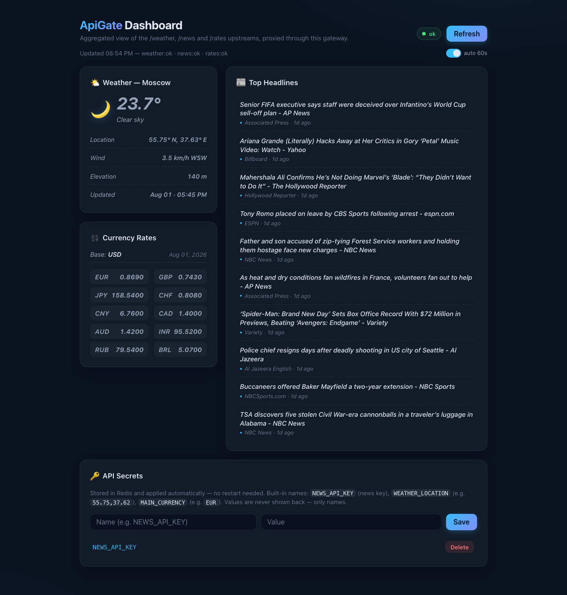

# ApiGate

API Gateway in Go. Proxies `/weather` and `/news` to external APIs, caches GET responses in Redis, rate-limits per-IP with a sliding window, and serves an aggregated `/dashboard` with a web UI.

## Screenshot



## Quick start

Prerequisites: Go 1.22+ and a running Redis on `localhost:6379`.

```bash
redis-server redis.conf    # start Redis with persistence (run from repo root)
go run ./cmd/apigate
```

Open http://localhost:8080 — the dashboard loads weather, news and currency rates, and the 🔑 **API Secrets** card lets you store API keys in Redis.

### Restarting the server keeps your secrets

Secrets and settings are stored in **Redis**, not in memory — the app reads them on every request, so restarting the Go server keeps them. Redis is configured (`redis.conf`) with **RDB snapshots + AOF**, so the data also survives Redis restarts.

On startup the app logs what it picked up from Redis, e.g.:

```
secrets loaded from Redis: [NEWS_API_KEY WEATHER_LOCATION MAIN_CURRENCY]
```

Persistence files (`dump.rdb`, `appendonlydir/`) are written to the repo root and gitignored — never commit them.

## Data sources

| Card | Source | Key required |
| --- | --- | --- |
| Weather | [open-meteo](https://open-meteo.com) (`api.open-meteo.com`) | No |
| Place name | [BigDataCloud](https://www.bigdatacloud.com) reverse-geocoding | No |
| News | [NewsAPI](https://newsapi.org) (`newsapi.org/v2/everything`, popular English articles from all countries) | Yes (`NEWS_API_KEY`) |
| Currency rates | [ExchangeRate-API](https://www.exchangerate-api.com) (`api.exchangerate-api.com/v4/latest/<base>`) | No |

Weather and news URLs are overridable via env vars (`WEATHER_API_URL`, `NEWS_API_URL`) — this applies to **both** the reverse-proxy routes and the dashboard aggregation; the place-name and rates URLs are hardcoded. Rates are fetched live per dashboard request (the `/dashboard` page is never cached).

## Getting an API key

The only API needing a key is **NewsAPI**:

1. Register at https://newsapi.org.
2. Your API key is shown on the account page (free plan works on `localhost`).
3. Add it either way:
   - In the app: open the page, scroll to **🔑 API Secrets**, enter name `NEWS_API_KEY`, paste the key, click **Save**. No restart needed.
   - Or via env var: `NEWS_API_KEY=... go run ./cmd/apigate`.

If the key is missing or invalid, the dashboard shows a hint naming the secret to add (`missingSecrets: ["NEWS_API_KEY"]`).

The free NewsAPI plan allows **100 requests per 24h**. ApiGate enforces this as a shared daily budget: once spent, `/news` returns `429` and the dashboard's news card shows a "Daily newsapi quota exceeded" message — weather and rates keep working. The counter resets at midnight local time and is per deployment, not per client IP.

### What to enter for each secret

In the **🔑 API Secrets** card, the **Name** field selects a setting and the **Value** field is its value. The three built-in names:

| Name (enter in "Name") | Value (enter in "Value") | Effect | Default if not set |
| --- | --- | --- | --- |
| `NEWS_API_KEY` | Your NewsAPI key, e.g. `a1b2c3d4e5f6...` | News feed starts loading | — (news shows an error) |
| `WEATHER_LOCATION` | `latitude,longitude`, e.g. `55.75,37.62` | Weather for that location | `55.7558,37.6173` (Moscow) |
| `MAIN_CURRENCY` | 3-letter code, e.g. `EUR` | Base currency for rates | `USD` |

Example: to show Moscow weather, enter `WEATHER_LOCATION` in the Name field and `55.75,37.62` in the Value field, then click **Save**.

Notes:
- Values are **never shown back** — the UI and API list only names.
- A name must match `[A-Za-z0-9_-]+`; an invalid `WEATHER_LOCATION` falls back to the default.
- Each setting can also be provided via an env var of the same name; the Redis value wins.
- Data persists across restarts (see [Restarting the server keeps your secrets](#restarting-the-server-keeps-your-secrets)).

## Configuration (env vars)

| Variable | Default | Description |
| --- | --- | --- |
| `REDIS_ADDR` | `localhost:6379` | Redis address |
| `PORT` | `8080` | HTTP listen port |
| `WEATHER_API_URL` | `https://api.open-meteo.com/v1/forecast` | Weather upstream (empty = route disabled) |
| `NEWS_API_URL` | `https://newsapi.org/v2/everything?language=en&sortBy=popularity&pageSize=20` | News upstream (empty = route disabled) |
| `NEWS_API_KEY` | — | NewsAPI key fallback (Redis `secret:NEWS_API_KEY` wins) |
| `NEWS_DAILY_LIMIT` | `100` | NewsAPI free-plan daily request budget, shared by `/news` and the dashboard news block |
| `WEATHER_LOCATION` | `55.7558,37.6173` | Weather `lat,lon` (Redis `secret:WEATHER_LOCATION` wins) |
| `MAIN_CURRENCY` | `USD` | Rates base currency (Redis `secret:MAIN_CURRENCY` wins) |

## Endpoints

- `/` — dashboard UI (static HTML, not cached)
- `/dashboard` — aggregated JSON: `weather` (+ `weatherPlace`, the reverse-geocoded place name), `news`, `rates`, plus `missingSecrets`/`error`. The weather card shows the location name; the currency card lists the **most popular currencies** against the base (EUR, GBP, JPY, CHF, CNY, RUB, …) in popularity order — not alphabetical. The response is sent with `Cache-Control: no-store`, and the served HTML page too, so updates are never stale.
- `/weather`, `/news` — reverse-proxied GETs (cached in Redis: 300s / 60s, rate-limited 100 req/min per IP). Query params baked into the configured upstream URL are merged in, with the request's own params taking precedence. `/news` additionally enforces a **daily quota** (default 100 req/day, `NEWS_DAILY_LIMIT`): once exhausted it returns `429` with a newsapi-style error body.
- `/healthz` — liveness probe: Redis `PING` → 200/503; exempt from caching and rate limiting
- `/api/secrets` — secret store: `GET` lists names (values never returned), `POST {name, value}` upserts, `DELETE ?name=` removes

## Architecture

- `cmd/apigate` — composition root (`run()` + graceful shutdown: `signal.NotifyContext` → `http.Server.Shutdown` with a 10s timeout, server timeouts set); wiring (outer→inner): request logging → panic recovery → rate limiting → cache → mux (rate limiting runs outside the cache).
- `internal/proxy` — `httputil.ReverseProxy` per upstream, exposed as `Proxy.Weather()` / `Proxy.News()`; appends `apiKey` to `/news` from the secret store if missing.
- `internal/cache` — GET-only; custom binary serialization (2-byte status + headers + body), per-route TTLs.
- `internal/ratelimit` — sliding window over a Redis ZSET per IP (`X-Forwarded-For` first value, else `RemoteAddr`); `/healthz` exempt.
- `internal/quota` — global daily budget (NewsAPI's free-plan 100 req/day) as an atomic Redis counter via a Lua script; the counter is shared by `/news` and the dashboard news block, so both stop consuming once the day's budget is spent (cached `/news` responses don't count).
- `internal/middleware` — `RequestLogger` (access log without query string), `Recover` (panic → logged 500), `Health` (Redis PING for `/healthz`), `ClientIP` (shared with ratelimit).
- `internal/aggregation` — `/dashboard` fans out 4 upstream fetches (weather, reverse-geocoded place name, news, rates) under a 10s timeout, resolving settings per request. Dependencies (HTTP client, logger, upstream URLs) are injected via functional options.
- `internal/secrets` — Redis-backed key store (`secret:<name>`), REST API wired with Go 1.22+ method routes on `/api/secrets`.

## Development

```bash
go build ./...
go vet ./...
go test ./...
```

Unit tests for `proxy`, `cache`, `ratelimit`, `quota`, `secrets`, `aggregation` and `middleware` run without a live Redis.
